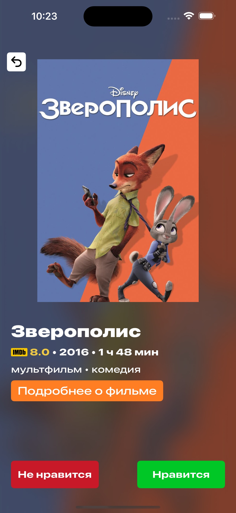
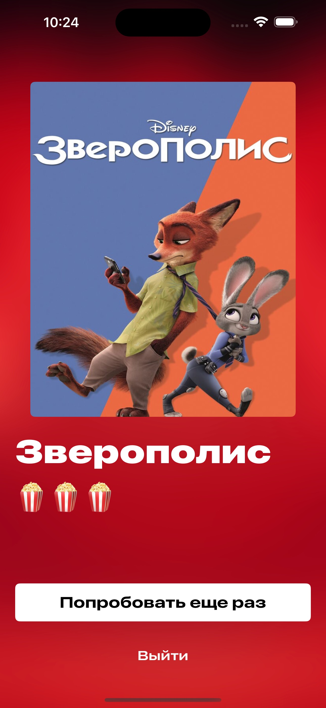

# ITMO DevDays Fall 2024 
# #18 MovieMate
iOS-приложение для выбора фильма для компании

**MovieMate: Watch Together** — приложение позволяющее легко и удобно выбрать кино для совместного досуга.

Иногда нет ничего лучше, чем посмотреть хороший фильм в конце дня. 
В один клик доступен бесконечный каталог фильмов, но... 
Вы когда-нибудь тратили слишком много времени на обсуждение того, что смотреть с вашим партнером? 
Если ваш ответ "да", это приложение идеально для вас.

### Ключевые особенности:
- Подборки фильмов по жанрам для двух (и более) человек
- Алгоритм поиска обоюдно понравившихся фильмов
- Удобный интерфейс для выбора кино

## Технологии и инструменты

### Требования
- Устройство под управлением iOS 16.0 или выше.

### Стек технологий
- Swift
- UIKit
- Combine
- Swift Concurrency
- Alamofire
- Cocoapods

### Структура проекта

- `MovieMate/` - исходные файлы приложения

## Скриншоты

### Главный экран

### Выбор жанра

### Выбор фильма

### Итоговый результат

**MovieMate: Watch Together** - ваш надежный спутник для выбора фильма на вечер. Наслаждайтесь просмотром вместе!

# Презентация
https://docs.google.com/presentation/d/1BF1rZZe5X0MjMT2s9wwvjVFb_E5W_osR/edit?usp=sharing&ouid=109217328439205395137&rtpof=true&sd=true
# Видео-демо
https://youtu.be/jM-Zu5Kno1s?si=3PFfDSUQukDqnFSh

# Команда
1. Белошицкий Денис Романович: тимлид + iOS-разработчик
2. Заранкович Антон Викторович: дизайнер (приложение + презентация)
3. Матюшов Илья Владимирович: iOS-разработчик
4. Трофимов Артём Алексеевич: backend-разработчик
5. Шарифуллин Ильдан Айдарович: архитектор
